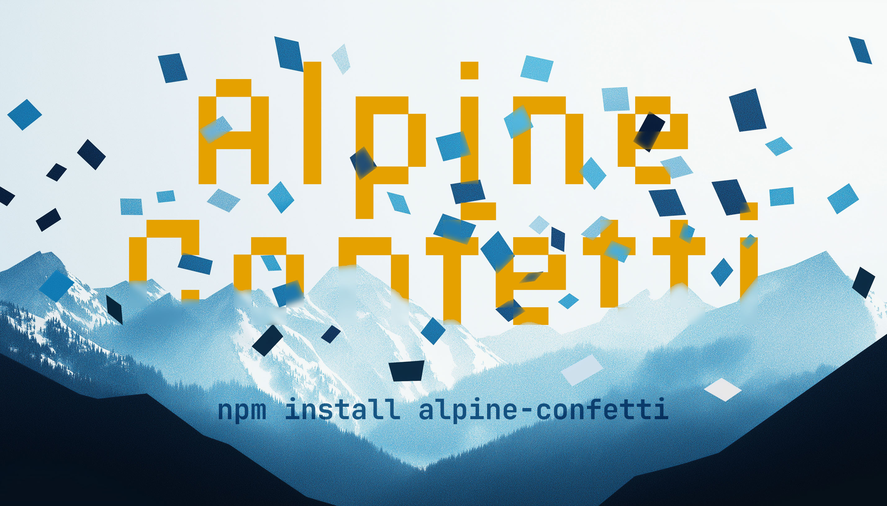

<h1 align="center">🎉 Alpine Confetti</h1>

<p align="center" style="text-wrap: balance;">
  Turn any interaction into a moment of joy* with zero-config <a href="https://alpinejs.dev" target="_blank">Alpine.js</a> directives for <a href="https://www.npmjs.com/package/canvas-confetti" target="_blank">canvas-confetti</a>.
</p>

<p align="center">
  <a href="https://www.npmjs.com/package/alpine-confetti">
    
  </a>
  <a href="https://www.npmjs.com/package/alpine-confetti">
    
  </a>
  <a href="https://www.jsdelivr.com/package/npm/alpine-confetti">
    
  </a>
  <a href="https://www.npmjs.com/package/alpine-confetti">
    
  </a>
</p>

<p align="center">
  <small>* Disclaimer: actual joy may vary.</small>
</p>



## ✨ Features

- **Three presets**: ` 🎉 $confetti()`, `✨ $starburst()`, and `💩 $emojify()`
- **Zero configuration**: Works out of the box with sensible defaults
- **Highly customizable**: Full access to `canvas-confetti` options
- **Smart positioning**: Automatically calculates element origins
- **Accessibility friendly**: Respects `prefers-reduced-motion`
- **TypeScript support**: Fully typed for better developer experience


## 👀 Interactive Demo

> See interactive examples [on the Demo page](https://jackwh.github.io/alpine-confetti/) ➡️

## 🚀 Quick Start

### CDN Installation

Add Alpine Confetti to your page via CDN:

```html
<!DOCTYPE html>
<html>
<head>
    <!-- Make sure the plugin is loaded before Alpine.js: -->
    <script defer src="https://cdn.jsdelivr.net/npm/alpine-confetti@latest/dist/browser.global.js"></script>
    <script defer src="https://cdn.jsdelivr.net/npm/alpinejs@3.x.x/dist/cdn.min.js"></script>
</head>
<body>
    <button x-data x-on:click="$confetti()">
        🎉 Let's Party
    </button>
</body>
</html>
```

### NPM Installation

```bash
npm install alpine-confetti
```

Then register the plugin:

```javascript
import Alpine from 'alpinejs';
import AlpineConfetti from 'alpine-confetti';

Alpine.plugin(AlpineConfetti);

window.Alpine = Alpine;
window.Alpine.start();
```

## 🔧 Usage

### Basic Confetti

The simplest way to add celebration to any element:

```html
<div x-init="$confetti()">
  🎉 Congrats, you're our 1,000,000th user!
</div>
```

### Starburst Effect

Perfect for achievements and special moments:

```html
<button x-data x-on:click="$starburst(25)">
  ⭐ Add to Favorites
</button>
```

### Custom Effects

You can change the particle count by providing a number: `$confetti(50)`. Or pass an object [with `canvas-confetti` options](https://github.com/catdad/canvas-confetti?tab=readme-ov-file#options) for more control:

```html
<button x-data x-on:click="$confetti({
    particleCount: 200,
    spread: 70,
    colors: ['#e81416', '#ffa500', '#faeb36', '#79c314', '#487de7', '#4b369d', '#70369d']
  })">
  👀 Many more options are available...
  <!-- https://github.com/catdad/canvas-confetti?tab=readme-ov-file#options -->
</button>
```

### Emojify

Because sometimes regular particles just won't do...

```html
<div x-init="$emojify(['🎂', '🎈', '🎁'], 50)">
    🎂 Happy Birthday to you!
</div>
```

## 🎨 Creative Example

There are lots of ways to use confetti effects interactively.
 
Here's just one example, check out the rest on the [Demo page](https://jackwh.github.io/alpine-confetti/) for more ➡️

```html
<button
  x-data="{
    isHovering: false,
    volcano() {
      if (this.isHovering) {
        $confetti({
          particleCount: Math.floor(Math.random() * 10),
          colors: ['#1c1917', '#262626', '#09090b', '#57534e'],
          angle: 75 + (Math.random() * 30),
          gravity: 0.1 + (Math.random() * 0.2),
          drift: Math.random() * (Math.random() > 0.5 ? 1 : -1),
          ticks: 10 + (Math.random() * 200),
          spread: (Math.random() * 50),
          startVelocity: 10 + (Math.random() * 10)
        });
      }
      this.schedule();
    },
    schedule () {
      setTimeout(() => this.volcano(), 250 * (Math.random() * 3));
    }
  }"
  x-init="schedule"
  x-on:mouseenter="isHovering = true"
  x-on:mouseleave="isHovering = false"
  x-on:click="$confetti({
      particleCount: 100 + Math.floor(Math.random() * 200),
      scalar: 1.5,
      angle: 75 + (Math.random() * 30),
      gravity: 0.2 + (Math.random() * 0.3),
      drift: Math.random() * (Math.random() > 0.5 ? 1 : -1),
      ticks: 50 + (Math.random() * 250),
      spread: 10 + (Math.random() * 50),
      colors: ['#b91c1c', '#9a3412', '#f59e0b', '#fcd34d', '#292524', '#450a0a'],
      startVelocity: 20 + (Math.random() * 10)
  })">
  🌋 Click to Erupt 
</button>
```

See the [Demo page](https://jackwh.github.io/alpine-confetti/) to try this out.

## 🎛️ API Reference

### `$confetti(options?)`

Creates a burst of confetti from the element.

- **Parameter**: `number | Options` - Particle count or full options object
- **Default**: 100 particles with colorful confetti

### `$starburst(options?)`

Creates a starburst effect with star-shaped particles.

- **Parameter**: `number | Options` - Particle count or full options object  
- **Default**: 10 yellow star particles in all directions

### `$emojify(emojis, options?)`

Creates confetti using custom emoji shapes.

- **Parameters**: 
  - `emojis`: `string[]` - Array of emoji to use as particles
  - `options`: `number | Options` - Particle count or full options object
- **Default**: `['🍓', '🍌', '🥝']` with 10 particles

## ⚙️ Configuration Options

All methods accept the full range of [canvas-confetti options](https://github.com/catdad/canvas-confetti?tab=readme-ov-file#options). Here's a quick reference for the most commonly used ones:

```javascript
{
    particleCount: 100, // Number of particles
    angle: 90,          // Direction in degrees
    spread: 45,         // Spread in degrees
    startVelocity: 45,  // Initial velocity
    decay: 0.9,         // Particle decay rate
    gravity: 1,         // Gravity strength
    drift: 0,           // Side-to-side drift
    ticks: 200,         // Particle lifetime
    colors: ['#fff'],   // Color array
    scalar: 1           // Size multiplier
}
```

The plugin respects the `prefers-reduced-motion` media query by default. Users with motion sensitivity won't see the animations.

## 🙏 Credits

- 🎊 [canvas-confetti](https://github.com/catdad/canvas-confetti)
- ⛰️ [Alpine.js](https://alpinejs.dev)
- 🎨 [Tailwind CSS](http://tailwindcss.com) (for demo styles)
- 🍳 [Jack W-H](https://github.com/jackwh)
- 🫵 You? Contributions are welcome!
